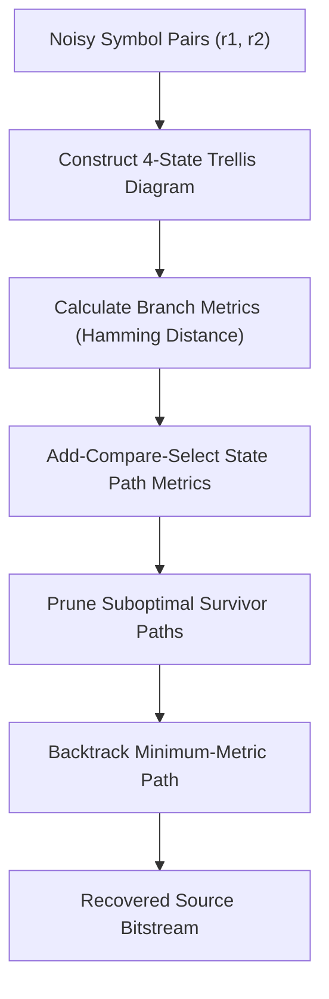

# genpark-viterbi-convolutional-decoder-skill

Agent Skill implementing the **Viterbi Trellis Algorithm** for maximum-likelihood decoding of rate 1/2 constraint-length $K=3$ convolutional codes over noisy communication channels.

## Architectural Overview

